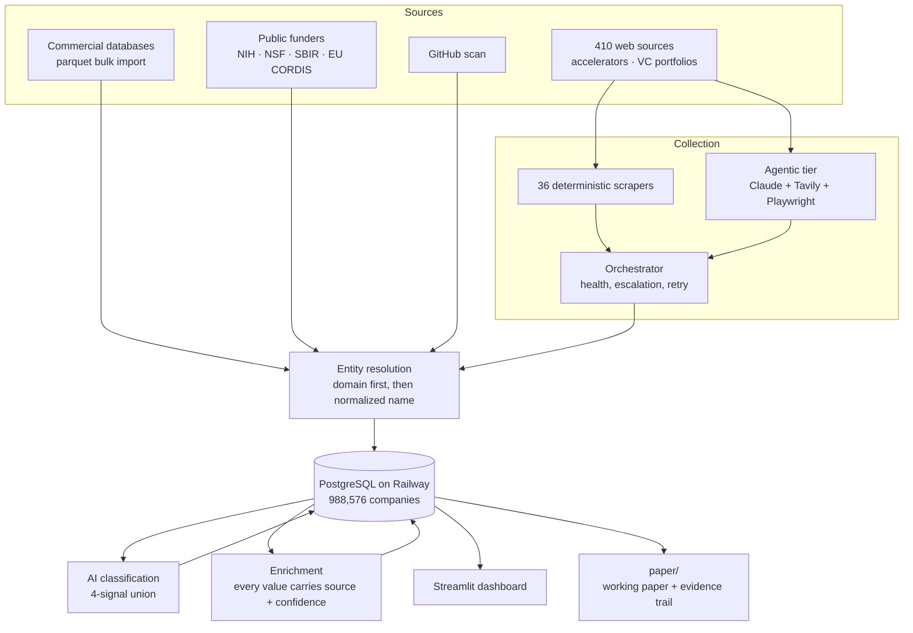

# AI Startup Tracker

**Data infrastructure for studying how artificial intelligence is reshaping the
global startup ecosystem.** Built at the Tobin Center for Economic Policy, Yale
University, supporting research supervised by Professor Song Ma.

The system collects company records from commercial databases, public funder
registries, an open-source code host and hundreds of international web sources;
resolves them into one company table; classifies which are AI-related; and
serves the result through a public dashboard.

**Live dashboard:** https://tobinresearchmerge-production-dfda.up.railway.app

---

## Current state

| | |
|---|---|
| Companies | **988,576** |
| Database size | 1,067 MB (Railway Postgres) |
| Countries represented | 280 values, 954,370 companies with a country |
| Deterministic scrapers | 36 |
| Web sources attempted | 410 |
| Commits | 196, Feb – Sep 2026 |

**The collection pipeline is currently idle.** Last scrape run 2026-07-09; the
newest company row is 2026-08-13. Railway serves the dashboard only — there is
no cron or scheduled scraping. The dataset is a snapshot, not a live feed.

---

## Architecture



### Two-tier collection

Deterministic scrapers handle sites with stable structure. When one fails twice,
the orchestrator escalates that domain to an agentic tier (Claude deciding which
pages to fetch, Tavily extracting, Playwright for JavaScript-heavy pages). On
success the agent writes a YAML instruction file so the next run takes the cheap
path. Three failures suspend a site for 90 days.

Of 410 sites attempted, 220 ever produced a successful extraction. The
instruction files are a record of **attempts**, not a library of working recipes.

### Entity resolution

Domain is the primary key: URLs are reduced to the registrable domain and a
blocklist stops code hosts and social platforms being adopted as a company's
identity. Where there is no domain, matching falls back to exact normalized-name
equality.

**Known defect:** the name normalizer strips `ai`, `io`, `labs` and `tech` as
company suffixes, so `Compose.ai` and `Compose` collapse to the same key. This
accounts for 54.6% of name-collision exposure and is AI-correlated. Documented in
`paper/main.tex` §8.3; not yet fixed because re-resolving changes every count in
the paper.

### AI classification

Four signals unioned — vendor taxonomy tag, keyword score, free-text mention, and
an LLM verdict. The canonical predicate is `backend/utils/ai_filter.py`; import
it rather than hand-writing the SQL, because an earlier duplicate-SQL era had the
threshold inconsistent across the dashboard and the analysis scripts.

Validated against 599 independently adjudicated firms: precision 0.59, recall
0.82, F1 0.69. Per-bucket precision varies from 0.47 to 0.84, which is why the
paper's headline is corrected for classification error.

### Enrichment under an evidence hierarchy

Registries (free, checkable) before fetched documents, before a model reading a
text we hold. A model is never asked to recall a fact. Every stored value carries
its source and confidence in `company_enrichment.sources`.

That provenance column is what made one mistake recoverable: an early pass let
the model *estimate* unstated fields, and it filled 7,553 values with its own
prior — San Francisco for 33.7% of cities, 2020 for 19.1% of founding years.
Because each value was tagged at write time, all of them were removed exactly.

---

## Where the data lives

| Layer | What | Size |
|---|---|---|
| **Railway Postgres** | The source of truth. 16 tables; `companies` is 940 MB of the 1,067 MB | 1,067 MB |
| **`data/`** (git-ignored) | Raw source files the importers read: Crunchbase, PitchBook, SBIR, CORDIS, employment data | ~7 GB |
| **`output/`, `results/`** | Committed aggregate CSVs. **Not leftovers** — the dashboard's Findings page reads `output/*.csv` at runtime | ~1 MB |

Two ways to reach the database:

- **From inside Railway** (the dashboard): `postgres.railway.internal`, private network
- **From a laptop:** `DATABASE_PUBLIC_URL` via `viaduct.proxy.rlwy.net`, a TCP proxy that drops idle connections

```bash
# Correct — every analysis script needs this
railway run -s Postgres -- .venv/bin/python scripts/<name>.py
```

> **`.env` points at a local Postgres that is empty.** Running a script without
> `railway run` connects to nothing useful. This is the single most common way to
> get confusing results here.

---

## Repository layout

```
ai-startup-tracker/
  backend/
    db/            SQLAlchemy models, connection, migrations
    scrapers/      36 deterministic scrapers + agentic wrapper
    agentic/       Claude + Tavily engine, instruction YAML cache
    orchestrator/  routing, health, escalation
    utils/         ai_filter, scoring, dedup, domain, country, industry
  scripts/         83 scripts — see scripts/README.md for the map
  analysis/        paper analyses (run against Railway)
  experiments/     validation: classifier eval, entity resolution, imputation
  frontend/        Streamlit dashboard (deployed)
  results/         analysis outputs, one CSV per finding
  output/          older analysis CSVs the dashboard reads at runtime
  reports/         dated working notes
paper/             working paper, figures, tables, evidence trail
docs/archive/      superseded handoffs, kept for the record
```

Start with **`scripts/README.md`** — 83 scripts grouped by purpose, with the ones
that are one-time or superseded marked as such.

---

## Deployment

Railway project `zestful-truth`, two services:

- **`Tobin_Research_Merge`** — the dashboard. Builds from the GitHub repo of the
  same name via `Dockerfile` → `entrypoint.sh`, which runs `init_db()` then
  Streamlit on Railway's injected `$PORT`. Healthcheck `/_stcore/health`.
  Push to that repo's `main` and it redeploys.
- **`Postgres`** — the database.

---

## The research output

`paper/` holds a working paper on what this infrastructure makes measurable. Its
central finding is that companies absent from the commercial databases are about
twice as likely to be AI-related (23.8% against 12.4% and 10.7%), which means
studies built on those databases alone understate AI entry.

- `paper/main.tex` — the paper
- `paper/CLAIM_EVIDENCE.md` — every number mapped to the script and output that produces it
- `paper/RESEARCH_GAPS.md` — what must be done before it is final
- `paper/SOURCES.md` — code map, and a list of corrections where the repo's own docs were wrong

---

## Known issues

Kept here rather than discovered later:

- **`github_signals` and `github_repo_snapshots` are empty.** The repo-to-company
  linkage was lost. 56,981 GitHub-sourced companies survive as `companies` rows,
  but their repo names, star counts and the per-repo LLM classification are gone.
  The GitHub Discovery page falls back to the account-level entity check, which
  did survive, and says so.
- **`source_matches` is empty.** It is described as the entity-matching audit
  trail but nothing INSERTs into it, so match decisions are not individually
  auditable.
- **98 GitHub logins map to more than one `companies` row** — duplicates the
  resolver never merged because neither row has a domain.
- **Migrations are hand-rolled.** A guarded `ALTER TABLE` list in `init_db()`
  runs on every boot. Append-only: no renames, no type changes, no rollback.
- **The multi-vintage panel results are not currently reproducible** — the
  snapshot files were deleted to free disk. See `paper/RESEARCH_GAPS.md` §2.1.
- **`backend/main.py` and `agent/` are an un-deployed pair.** `main.py` is a
  FastAPI service whose `/api/scout` endpoint shells out to `agent/agent.py`;
  `entrypoint.sh` runs only Streamlit, so neither is live. They are kept because
  the dependency is real — `agent/` looks unused until you notice it is invoked
  by subprocess rather than imported — and removing an API surface is a decision
  for whoever owns the roadmap.

---

## Setup

```bash
cd ai-startup-tracker
python -m venv .venv && source .venv/bin/activate
pip install -r requirements.txt

cp .env.example .env     # GITHUB_TOKEN, ANTHROPIC_API_KEY, TAVILY_API_KEY

# Read from production
railway run -s Postgres -- .venv/bin/python analysis/inventory.py

# Dashboard locally
railway run -s Postgres -- .venv/bin/streamlit run frontend/pipeline_dashboard.py
```
