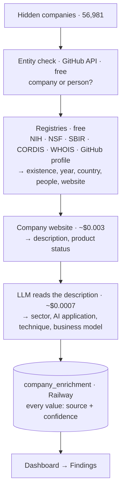

# How we fill in the invisible companies

**Hidden company** = in our tracker, **not** in Crunchbase and **not** in PitchBook.
As of 2026-08-14 there are **56,981** of them.

The method rests on three rules, in this order.

---

## Rule 1 — Define the population before counting it

"56,981 hidden companies" is not a finding until we can say which of them are
companies. Most arrived from a GitHub scan, where a name alone tells us nothing,
so we asked GitHub directly rather than assuming.

| Layer | Count | How we know |
|---|---|---|
| Everything we found | 56,981 | — |
| − personal GitHub accounts | −11,169 | GitHub API returned `type: User` |
| **Verified entities** | **45,812** | organisation, funder record, or portfolio listing |
| — of those, analysable | 36,534 | has a domain or a description |
| — **of those, AI companies** | **26,981** | classified from its own description |

**26,981 is the number to use in analysis.** The others are reported as what they
are, not quietly dropped and not quietly counted.

A name with a space or a full stop — `In-Pipe Robot Inc.` — cannot be a GitHub
login, so 4,527 of these were settled by rule without spending a request. That
also means a 404 from GitHub keeps its meaning for the names that remain.

---

## Rule 2 — Evidence hierarchy: prefer the record over the model

An LLM asked "who founded this company?" will answer. For companies nobody has
indexed — which is the entire population here — it has nothing to recall, so it
produces something plausible instead. Facts therefore come from records, and the
model is used to **read**, never to **remember**.

| Tier | Source | Cost | What it can establish |
|---|---|---|---|
| **1. Official registries** | NIH, NSF, SBIR, EU CORDIS, WHOIS, GitHub API | **$0** | company existence, first award year, country, city, named executives, employee count, website |
| **2. Documents we fetch** | the company's own website | ~$0.003 | description, product status, pricing posture |
| **3. Model reading a text** | LLM over a description we hold | ~$0.0007 | sector, AI application, AI technique, business model |
| **4. Model recalling a fact** | — | — | **not used** |

Tier 1 did the heavy lifting and cost nothing: founding-year coverage went from
8.6% to 59.5% in one day on WHOIS creation dates, grant award years and GitHub
account creation dates, and 7,420 hidden companies gained named executives from
SBIR and NIH award records — data an LLM would have invented.

---

## Rule 3 — Every value carries its source and confidence

Stored per field in `company_enrichment.sources` as
`{field: {source, confidence}}`. This is not bookkeeping for its own sake — it
is what lets a claim be checked, and what let us undo a mistake cleanly.

**The mistake, and what it cost.** We tried letting the model estimate location,
founding year, team size and stage where the text did not state them. It filled
almost everything, and the result was:

| Field | Most common value | Share | Marked "inferred" |
|---|---|---|---|
| City | San Francisco | 33.7% | — |
| Team size | 11–50 | 70.6% | 99.8% |
| Country | United States | 46.1% | 93.8% |
| Founding year | 2020 | 19.1% | 95.9% |

That is the model's prior — the median startup — repeated for every company. A
chart of it would have looked exactly like a finding. Because each value was
labelled at write time, all **7,553** estimated values were removed precisely,
with their source entries, leaving nothing behind.

What remains is honest and uneven: the taxonomy fields fill at 100% because the
model is reading a description; country fills at 0.6% from descriptions because
descriptions rarely name a country; founding year fills at 44% because grant
descriptions genuinely state the award year.

**We would rather report 26,981 companies we can defend than 56,981 we cannot.**

---

## Country: grouped, and only where the value is a country

Per-country counts thin out fast past the top twenty, so countries roll up to
13 regions and 5 continents. Regions separate places that behave differently as
ecosystems rather than places that are merely adjacent — Israel sits in Middle
East, not with North Africa.

The column also contains US states, bare city names and stray coordinates
(`Minnesota`, `MA 02139`, `11.27507`). These resolve to **no region at all**
rather than being forced into one; they are 0.8% of the rows with a country and are
excluded from regional counts rather than mis-assigned.

Of the 27,588 hidden companies that have a country value:

| Region | Hidden | Share |
|---|---|---|
| North America | 15,983 | 57.9% |
| Western Europe | 3,642 | 13.2% |
| East Asia | 2,086 | 7.6% |
| Southern Europe | 1,151 | 4.2% |
| South Asia | 1,141 | 4.1% |
| Other 9 regions | 3,356 | 12.2% |
| Not a recognised country | 229 | 0.8% |

Continents: Americas 59.5% · Europe 21.6% · Asia 15.1% · Africa 1.8% · Oceania 1.2%.

---

## Where hidden companies come from, and how clean each channel is

Discovery yield measured against our own data — the share of companies from a
channel that turn out to be in neither Crunchbase nor PitchBook:

| Channel | Hidden yield | Entities that are real companies |
|---|---|---|
| Public funder records (NIH, NSF, SBIR, CORDIS) | **100%** | **99.6%** |
| Accelerators and institutions | 96.5% | — |
| Lesser-known VC portfolios | 76% | 89.5% |
| **Well-known VC portfolios** | **23–30%** | — |
| GitHub scan | — | 75.8% |

A famous firm's portfolio page is already indexed everywhere, so scraping it
mostly re-finds companies we have. Public funder records are both the cleanest
and the most productive source, and they are bulk downloads rather than scrapes.

---

## Current coverage

Of the 45,812 verified entities:

| Field | Coverage |
|---|---|
| Founding year | 73.8% |
| Description | 65.8% |
| AI application / business model / sector | 58.9% |
| Country | 52.6% |
| Domain | 47.5% |
| City | 39.0% |
| Founders / executives | 16.2% |
| Product status | 9.2% |
| Team size | 5.8% |

Fields are not independent, and the intersection is what a regression can
actually use. Requiring description **and** domain **and** founding year **and**
country **and** AI classification together leaves **5,778** companies — 21.4% of
the 26,981 classified, against per-field figures of 47–74%. Any model needing
all five variables runs on that 5,778, and saying so up front is more useful
than a coverage table that implies otherwise.

---

## Known limits

- **Founding year is a proxy.** Domain registration and first grant award bound
  the founding date from above; they are not incorporation dates and are
  reported as proxies.
- **Named people are executives at award time**, taken from SBIR/NIH records.
  A principal investigator is not necessarily a founder, so the job title is
  stored with the name.
- **Healthcare is likely overstated** at 20.8% of classified companies, because
  NIH is one of our largest sources. Application mix should be read by channel.
- **`ai_subfield` returns "other" for 63.7%** of companies — the descriptions
  are often too thin to identify a technique, and the taxonomy may need
  revisiting.
- **Coverage is uneven by origin.** Grant-sourced companies have country and
  year on every row; GitHub-sourced companies often have neither.
